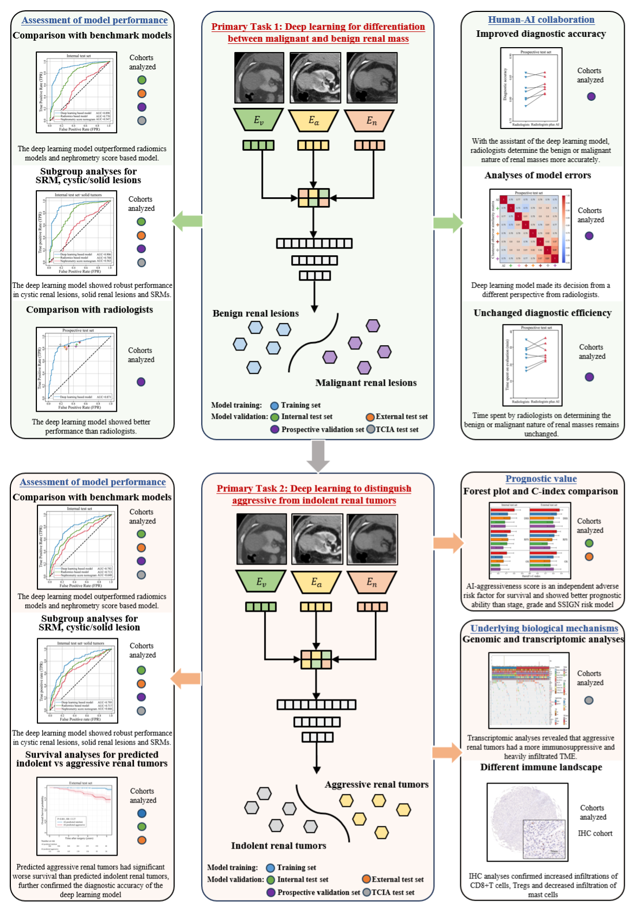

[//]: # ()


# Renal-Mass-AI
This repo contains the scripts for the segmentation, pre-processing, radiomics and deep learning-based prediction of pathologic outcomes using pre-operative multi-phase CT, as reported in the paper **Artificial Intelligence Links Preoperative CT Images to Pathologic Features, Survival Outcomes and Biological Behaviors of Renal Masses Using Real-World Data**.

[[paper]()]



## Dependencies
To install Python dependencies:

```
pip install -r requirements.txt
```

## Tumor segmentation
We employed the nnUNet (Version 1) framework to perform the segmentation of kidney and tumors. Please refer to the [nnUNet repository](https://github.com/MIC-DKFZ/nnUNet/tree/nnunetv1) for the configuration settings. The task ID for kidney tumor segmentation is 135 and segmentation models trained on [KiTS](https://kits19.grand-challenge.org/data/) can be downloaded. To use nnUNet directly:

```
nnUNet_predict -i INPUT_FOLDER -o OUTPUT_FOLDER -t 135 -m 3d_lowres
```
where INPUT_FOLDER is the folder of arterial phase CT images (*.nii.gz) and OUTPUT_FOLDER is the folder. In our work, we fine-tuned the segmentation models with in-house dataset and obtained improved segmentation of kidney (label 1), tumor (label 2) and cyst (label 3).  

## Image preprocessing
Base on the segmentation results, we located and cropped the kidney tumor. The axial slice with maximum tumor area was extracted (reviewed by experts) and resampled to a spatial resolution of 0.625×0.625 mm, followed by cropping with an ROI of 224×224 px centering the tumor mass center. For the segmentation failure, the mass center was manually placed. 

Please see the [preprocess](./preprocess) folder for details. 


## Radiomics analysis
The radiomics analysis was conducted using [PyRadiomics](https://github.com/AIM-Harvard/pyradiomics). Please see the [documentation](https://pyradiomics.readthedocs.io/en/latest/installation.html) for installation and configuration. 
We extracted the shape features, histogram features, texture features of cropped multi-phase axial slices. Radiomics models for predicting malignancy and invasiveness were developed independently. LASSO regression was used for feature selection and Random Forest classifier was used for prediction. 

Please see the [radiomics](./radiomics) folder for implementation details. 

## Deep learning models
We developed a multi-view CNN with an intermediate feature fusion strategy. The image features were extracted with ResNet18 backbone and fused to make downstream task. The architecture was the same for the malignancy and invasiveness prediction tasks. 

Please see the [DL](./DL) folder for training details. 


## Citation
Updating soon.

If you have any question, please feel free to contact.

